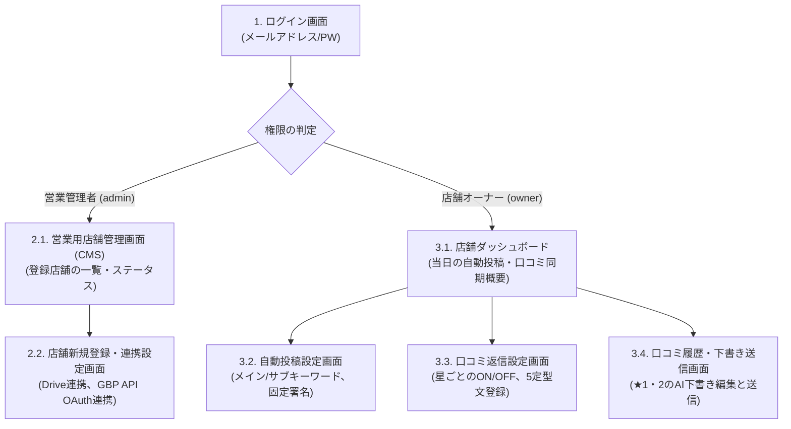

# MEO SEIHA 画面詳細設計書

- **ドキュメントバージョン**: 1.0.0
- **作成日**: 2026年7月15日
- **作成者**: 株式会社ジラーチ 開発チーム

本ドキュメントは、MEO自動化システム「MEO SEIHA」（365meo-app / thanxcreate-app - システム名称「MEO SEIHA」）における各管理画面のレイアウト構成、表示データ項目、ボタン等の配置、および画面遷移と動作仕様を定義する画面詳細設計書です。

---

## 1. 画面構成一覧と遷移図

システムは、ログインするユーザーの権限（営業管理者 / 店舗オーナー）に応じて、以下の通り表示する画面を自動で切り替えます。



---

## 2. ログイン前画面

### 2.1. 共通ログイン画面 (Login Screen)

#### 【画面レイアウトイメージ（ワイヤーフレーム）】
```text
+-------------------------------------------------------------------+
|                                                                   |
|                         [ MEO SEIHA ロゴ ]                        |
|                                                                   |
|                   メールアドレスでログイン                        |
|                   +---------------------------+                   |
|                   | email@example.com         |                   |
|                   +---------------------------+                   |
|                   パスワード                                      |
|                   +---------------------------+                   |
|                   | **********                |                   |
|                   +---------------------------+                   |
|                                                                   |
|                   [x] ログイン状態を保持する                      |
|                                                                   |
|                   +---------------------------+                   |
|                   |        ログインする       |                   |
|                   +---------------------------+                   |
|                                                                   |
+-------------------------------------------------------------------+
```

#### 【表示項目・動作仕様】
- **入力項目**:
  - `メールアドレス` (必須、バリデーションチェックあり)
  - `パスワード` (必須)
  - `ログイン状態を保持する` (チェックボックス)
    - チェック時：Cookieのセッション有効期限を「1年間」に設定し、次回以降は自動ログイン（自動ログイン保持機能）。
- **ログインボタン押下時の動作**:
  - 認証が成功した場合、ユーザーテーブル of `role` を判定します。
    - `role = "admin"` (営業担当): **「2.1. 営業用店舗管理画面 (CMS)」** へ遷移。
    - `role = "owner"` (店舗オーナー): **「3.1. 店舗ダッシュボード」** へ遷移。
  - 認証エラー時：画面上部に赤文字で「メールアドレスまたはパスワードが正しくありません」とエラーを表示。

---

## 3. 営業管理者向け画面 (CMS)

### 3.1. 営業用店舗管理画面 (CMSダッシュボード)

#### 【画面レイアウトイメージ】
```text
+-------------------------------------------------------------------+
|  [MEO SEIHA - CMS]  | ログインユーザー: 営業担当A  [ログアウト]   |
+-------------------------------------------------------------------+
|  [+ 新規店舗を追加する]                                           |
|                                                                   |
|  ■ 契約店舗一覧                                                   |
|  +--------------+-------------+---------------+----------------+  |
|  | 店舗名       | Drive同期   | GBP連携状況   | 稼働ステータス |  |
|  +--------------+-------------+---------------+----------------+  |
|  | 店舗A        | [正常同期]  | [連携済み]    | [自動投稿中]   |  |
|  | 店舗B        | [未共有]    | [未連携]      | [停止中]       |  |
|  +--------------+-------------+---------------+----------------+  |
|                                                                   |
+-------------------------------------------------------------------+
```

#### 【表示項目・動作仕様】
- **店舗一覧テーブル**:
  - `店舗名`: クリックすると該当店舗の「設定詳細画面」へ管理者としてジャンプ可能。
  - `Drive同期ステータス`: Google Drive APIスキャンが成功しているか（"正常同期"、"エラー: アクセス権なし"、"画像0枚"）。
  - `GBP連携状況`: 店舗オーナーがGoogle OAuth連携を完了しているか（"連携済み"、"未連携"）。
  - `稼働ステータス`: システムの自動投稿・返信が現在有効かどうか（"稼働中"、"停止中"）。
- **「+ 新規店舗を追加する」ボタン**:
  - 押下時：**「2.2. 店舗新規登録・連携設定画面」** へ遷移。

---

### 3.2. 店舗新規登録・連携設定画面

#### 【画面レイアウトイメージ】
```text
+-------------------------------------------------------------------+
|  [新規店舗の追加]                                                 |
+-------------------------------------------------------------------+
|  ■ 基本情報の入力                                                 |
|  店舗名:           [                           ]                  |
|  Googleアカウント: [ owner@gmail.com           ] (オーナーの連絡先) |
|                                                                   |
|  ■ Google Drive連携設定                                           |
|  ・専用フォルダID: [ folder-id-xyz             ]                  |
|  ・システム共有用メールアドレス (コピペ用):                        |
|    meo-seiha-drive-bot@gserviceaccount.com  [コピー]              |
|                                                                   |
|  ■ Googleビジネスプロフィール (GBP) 連携                          |
|  ・OAuthクライアントID:  (都田様取得のIDが自動適用)                 |
|  ・[Googleマイビジネスと連携する (OAuth連携)] (ボタン)             |
|                                                                   |
|  [この店舗をシステムに登録する]                                   |
+-------------------------------------------------------------------+
```

#### 【表示項目・動作仕様】
- **Google Drive連携手順**:
  - 営業担当者は、Google Drive上に店舗用のフォルダを作成し、そのフォルダIDを画面に入力します。
  - 画面に表示されている「システム共有用メールアドレス」をコピーし、店舗Driveフォルダの共有設定に「編集者」として追加します。
- **Googleマイビジネス連携 (OAuth連携)**:
  - 営業担当者が代理でその場で連携ボタンを押し、都田様のテスト用アカウントでログインしてアクセス許可を行います。（または、店舗オーナーに管理画面のURLを送り、自分で押してもらいます。）

---

## 4. 店舗オーナー向け画面

### 4.1. 店舗ダッシュボード (Shop Dashboard)

#### 【画面レイアウトイメージ】
```text
+-------------------------------------------------------------------+
|  [MEO SEIHA - 店舗] | [自動投稿] [自動返信] [履歴] | [ログアウト]  |
+-------------------------------------------------------------------+
|  店舗名: 合同会社THANX CREATE  /  Driveストック画像数: [ 5枚 ]     |
|                                                                   |
|  ■ 本日の自動投稿ステータス                                       |
|  ・次回投稿予定: 7月15日 12:00                                    |
|  ・投稿予定画像: [画像プレビュー]                                 |
|  ・投稿動作モード: 【交互投稿モード (画像1〜9枚)】                |
|                                                                   |
|  ■ 自動返信ステータス                                             |
|  ・自動返信機能: [ ON ] (トグルスイッチで都度切り替え可能)        |
|  ・保留中の下書き: 【 1件 】 あり -> [下書きを確認しに行く]       |
|                                                                   |
+-------------------------------------------------------------------+
```

#### 【表示項目・動作仕様】
- **Driveストック画像数**: ドライブから同期した画像の枚数を表示。枚数に応じて「動作モード」が自動切り替え表示されます。
  - 0枚: `【テキストのみ投稿モード】`
  - 1〜9枚: `【交互投稿モード (画像・テキスト交互)】`
  - 10枚以上: `【画像あり連続投稿モード】`
- **自動返信トグルスイッチ**:
  - 押下時：自動返信の実行フラグ（`reply_active`）を即座にON/OFF切り替え。

---

### 4.2. 自動投稿設定画面

#### 【画面レイアウトイメージ】
```text
+-------------------------------------------------------------------+
|  [自動投稿キーワード設定]                                         |
+-------------------------------------------------------------------+
|  ■ メインキーワード (毎回必ず含める単語 - 最大5つ)                |
|  1. [ 名古屋 MEO     ]   2. [ MEO 対策       ]                    |
|  3. [                ]   4. [                ]                    |
|                                                                   |
|  ■ サブキーワード (ランダムで毎回切り替える単語 - 最大15個)       |
|  1. [ 口コミ 対策    ]   2. [ GBP 運用       ]                    |
|  3. [ マップ 順位    ]   4. [ 集客 効果      ]                    |
|                                                                   |
|  ■ 固定フッター署名 (投稿文の末尾に自動付与)                      |
|  +-------------------------------------------------------------+  |
|  | 店舗名: 合同会社THANX CREATE                                |  |
|  | 住所: 名古屋市中区栄1丁目23-29                              |  |
|  +-------------------------------------------------------------+  |
|                                                                   |
|  [設定を保存する]                                                 |
+-------------------------------------------------------------------+
```

---

### 4.3. 口コミ履歴・下書き送信画面 (重要画面)

#### 【画面レイアウトイメージ】
```text
+-------------------------------------------------------------------+
|  [口コミ・返信履歴ログ]                                           |
+-------------------------------------------------------------------+
|  ■ 新着・保留中の下書き (星1・星2)                                |
|  投稿者: 山田太郎 / 評価: ★1                                      |
|  「接客がとても残念でした。二度と行きません。」                   |
|  +-------------------------------------------------------------+  |
|  | 【AI生成された謝罪文 (編集可能)】                            |  |
|  | 山田太郎様、この度は弊店の接客において不快な思いをさせてし  |  |
|  | まい、誠に申し訳ございませんでした。心よりお詫び申し上げます。|  |
|  +-------------------------------------------------------------+  |
|  [ 編集して返信を送信する ]                                       |
|                                                                   |
|  ■ 返信履歴ログ一覧                                               |
|  +------------------+----------+--------------------+----------+  |
|  | 投稿者           | 評価     | 口コミ内容         | 返信状況 |  |
|  +------------------+----------+--------------------+----------+  |
|  | 鈴木花子         | ★5       | 美味しかったです！ | 定型ランダム送信 |  |
|  | 佐藤次郎         | ★2       | 料理が冷めていた   | 送信完了(手動)   |  |
|  +------------------+----------+--------------------+----------+  |
|                                                                   |
+-------------------------------------------------------------------+
```

#### 【LINEからのマジックリンク自動ログイン連携】
- 店舗オーナーのスマホに星1・2検知時にLINEで届くURLは以下のような形式になります：
  `https://app.meo-seiha.jp/owner/reply/review-abc123xyz?auth_token=temp_token_987654`
- このURLをタップすると、システムは：
  1. `auth_token` の有効性（期限内か、正しい店舗アカウントか）を裏側で検証。
  2. ログイン画面をバイパスして、**自動で該当店舗のアカウントでログイン処理を実行**。
  3. **「4.3. 口コミ履歴・下書き送信画面」へ直接ジャンプ**し、対象の星1口コミに対する「AI生成謝罪文の編集フォーム」にフォーカスを当てた状態で画面が開きます。
