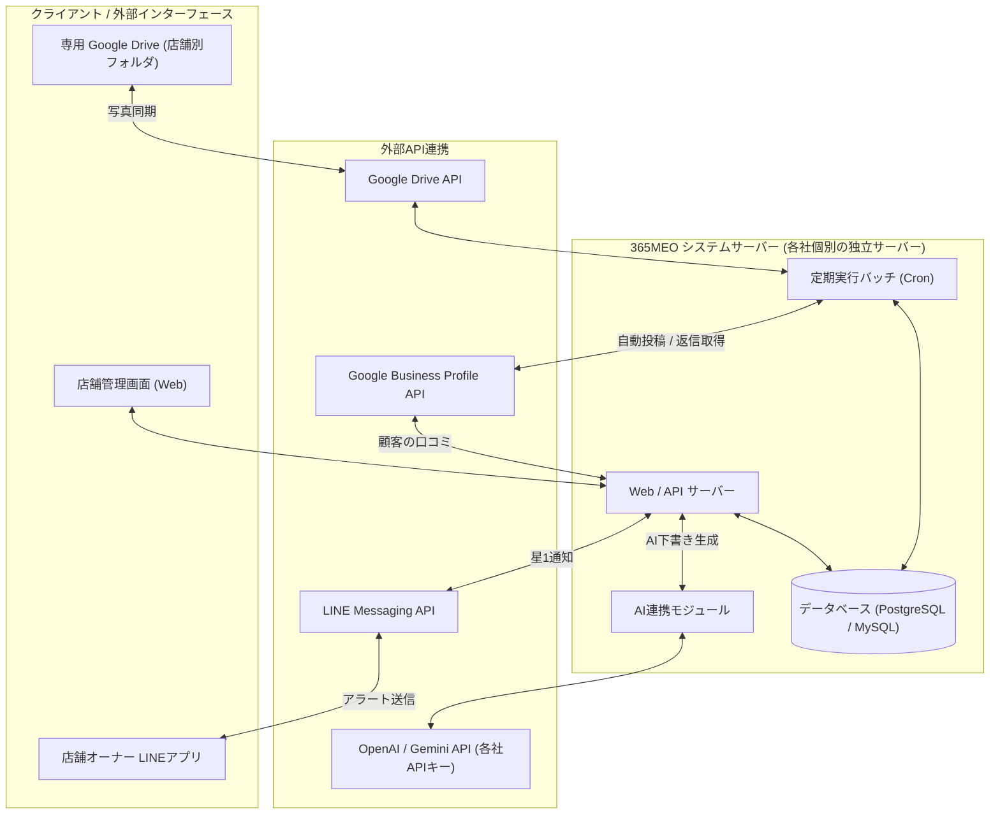
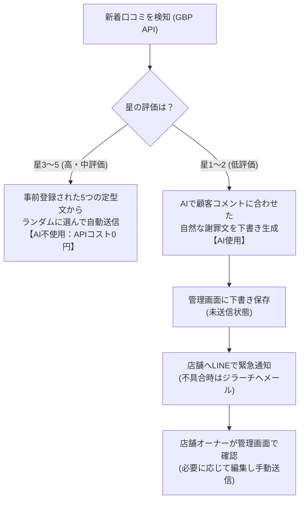

# 365MEO システム全体概要設計書

- **ドキュメントバージョン**: 1.0.0
- **作成日**: 2026年7月14日
- **作成者**: 株式会社ジラーチ 開発チーム

本ドキュメントは、365MEOシステムの開発・実装に向けた全体アーキテクチャ、機能モジュール仕様、データベース設計、外部API連携および運用フローを定義するシステム設計書です。

---

## 1. システム全体概要 & ユースケース

365MEOシステムは、店舗事業者のGoogleビジネスプロフィール（GBP）の運用（日々の写真自動投稿、口コミ自動返信、低評価検知アラート）を、Google Drive連携およびAI/定型エンジンを用いて効率化・自動化するシステムです。

### 登場人物（アクター）とユースケース

1. **店舗オーナー（加盟店）**
   - 専用管理画面にログインし、キーワード設定や口コミの自動返信ON/OFFを切り替える。
   - 自店舗専用の **Google Drive フォルダ** に写真をアップロード・削除するだけで、システムが画像を自動スキャンして投稿に利用する。
   - 口コミ返信履歴を確認し、保留中（星1・2）のAI生成下書き文を編集して送信する。
2. **営業・運用担当者（365 / THANX）**
   - 加盟店舗のアカウントを作成し、初期設定（GBP連携、LINE通知設定、Google Drive連携）を行う。
   - システム全体のAI APIキーの設定や管理を行う。
3. **システム（365MEO サーバー）**
   - 毎日定時にGoogle Driveから新しい画像を取得し、設定されたキーワードに基づいて自動投稿する。
   - 新着口コミを検知し、星3〜5は「5パターンの登録定型文からランダム送信」、星1〜2は「AIで個別の謝罪文を生成して下書き保存 ＋ 店舗へLINE緊急通知」を実行する。

---

## 2. システムアーキテクチャ（構成図）

システムは、将来的にそれぞれのブランド（365meo / Thanxcreate）が独自のカスタマイズや機能改修を個別に実施できるよう、スタート時点から**「2つの完全に独立したリポジトリ（ソースコード）および独立したサーバー・データベース」**として物理的に分離して構築します。
※これにより、顧客情報の隔離（セキュリティ担保）と、将来の柔軟な個別仕様アップグレードを両立させます。



---

## 3. 主要機能モジュールの詳細定義

### 3.1. Google Drive連携 ✕ 自動投稿モジュール
- **処理フロー**:
  1. 定期実行プログラム（バッチ）が、店舗ごとに紐付けられたGoogle Driveの専用フォルダを定期的にスキャンします。
  2. 新規の画像ファイルが検知された場合、システム側ストレージ（Cloudflare R2）へ自動同期・保存します。
  3. 毎日指定時間に、ストックされた画像から自動で1枚選択し、設定された「メインキーワード」および「サブキーワード（プールからランダム抽出）」を含んだ投稿テキストをAIで生成します。
  4. Google Business Profile API（GBP API）を介して、写真とテキストを自動投稿します。
- **画像枚数に応じた投稿挙動の自動最適化【合意済】**:
  - 店舗オーナーが専用Google Driveにアップロードしている画像の枚数（ストック数）に応じて、システムが以下の通り投稿モードを自動で切り替えます。
    - **【ストック0枚】**: 画像なし（テキストのみ）の投稿を毎日自動で繰り返します。
    - **【ストック1〜9枚】**: 同じ画像の連続投稿による効果低下を防ぐため、「画像あり投稿（Drive内画像をローテーション）」と「画像なし（テキストのみ）投稿」を<strong>毎日交互に投稿</strong>します。
    - **【ストック10枚以上】**: 画像なしの投稿を完全に廃止し、毎日異なる画像を使用した「画像あり投稿」を連続して実施します。
- **運用ルール【合意済】**:
  - 画像のアップロードや季節限定メニュー終了時の不要画像の削除は、365/THANXの営業担当より店舗オーナーへDrive上での直接操作を依頼・リマインドします。

### 3.2. 口コミ自動返信モジュール
顧客からの新着口コミ受信時の星評価に応じて、処理を以下のように分岐します。



- **自動返信（星3〜5）**:
  - 口コミ検知後、事前設定した5パターンの定型文からランダムで1つを自動で即時送信します（初動1回のみ、AI API費用は一切発生しません）。
- **低評価対応（星1〜2）**:
  - お客様の口コミ本文を読み取り、不満点（例: 「接客態度」「料理の提供時間」など）に寄り添った個別の丁寧な謝罪文をAI（Gemini 1.5 Flash等）で動的に生成します。
  - 生成された謝罪文は「下書き」として管理画面に保存され、自動送信は行われません。人が確認して手動で送信します。
  - 同時に、店舗オーナーの登録LINE宛てに「低評価の口コミが投稿されました」と緊急通知を送ります。

---

## 4. データベース設計（データモデル概要）

365用・THANX用にそれぞれ独立したデータベースを個別に構築するため、単一のデータベース内でのテナント管理テーブル（Tenants）は不要となります。各社それぞれのデータベースは、以下のテーブル群で構成されます。

### 4.1. SystemSettings (システム設定テーブル)
システム全体で使用するAIの接続キーやグローバル設定を管理します。
- `id` (PK)
- `ai_provider` (利用するAIサービス名: "gemini" または "openai")
- `ai_api_key` (自社で用意したAIのAPIキー)
- `updated_at`

### 4.2. Users (ユーザーテーブル)
店舗オーナーおよび営業管理者を管理します。
- `id` (PK)
- `email` (メールアドレス / ログインID)
- `password_hash`
- `role` (権限: "admin"＝営業担当、"owner"＝店舗オーナー)
- `created_at`

### 4.3. Shops (店舗テーブル)
各加盟店（GBPアカウント）の基本情報を管理します。
- `id` (PK)
- `name` (店舗名)
- `google_location_id` (Googleマップ上のロケーションID)
- `google_drive_folder_id` (専用Google DriveフォルダのID)
- `line_user_id` (緊急通知を送るLINEアカウントの接続キー)
- `reply_active` (自動返信全体のON/OFFフラグ: true/false)
- `created_at`

### 4.4. ShopKeywords (店舗キーワード設定テーブル)
毎日自動投稿に使用するキーワードを管理します。
- `id` (PK)
- `shop_id` (FK)
- `main_keywords` (メインキーワード配列: 最大5単語)
- `sub_keywords` (サブキーワード配列: 最大15単語)
- `fixed_footer` (固定署名テキスト)
- `updated_at`

### 4.5. ReplyTemplates (返信テンプレートテーブル)
自動返信用に人間が登録しておく定型文パターンを管理します。
- `id` (PK)
- `shop_id` (FK)
- `star_rating` (対応する星数: 3, 4, 5)
- `templates` (定型文テキスト配列: 5パターン登録)
- `updated_at`

### 4.6. ReviewLogs (口コミ・返信履歴テーブル)
検知した口コミと、それに対する送信済・下書き状態の返信履歴を管理します。
- `id` (PK)
- `shop_id` (FK)
- `google_review_id` (Google側の口コミ一意ID)
- `reviewer_name` (投稿者名)
- `star_rating` (星の数: 1〜5)
- `comment` (口コミ本文)
- `reply_text` (返信テキスト / AI生成または選択された定型文)
- `status` (状態: "sent"＝送信完了、"draft"＝保留下書き、"failed"＝送信エラー)
- `created_at`

---

## 5. 外部API・認証連携設計

### 5.1. Googleビジネスプロフィール（GBP）API
- **認証方式**: OAuth 2.0
- **連携フロー**:
  - オンボーディング時、店舗管理者アカウントでGoogleログインを行い、システムに対して店舗情報の閲覧・更新権限（`https://www.googleapis.com/auth/business.manage`）を付与します。取得したリフレッシュトークンをDBに保管します。
- **使用API**:
  - `locations.localPosts` (毎日自動投稿の作成)
  - `locations.reviews` (口コミの取得・新着検知・返信送信)

### 5.2. Google Drive API
- **連携方式**: サービスアカウント認証（マルチドライブ対応）
- **複数Driveアカウント連携【合意済】**:
  - `365meo` と `Thanxcreate` でそれぞれ所有する別々のGoogle Driveアカウントを、それぞれのシステム（365meo-app と thanxcreate-app）に個別に登録し、会社（ブランド）ごとに画像ストレージを完全に分離した状態で独立運用します。
- **フォルダセキュリティ**:
  - 各社のDriveのマスターフォルダ内に、店舗ごとのサブフォルダを作成します。
  - 各店舗オーナーのGoogleアカウントに対して、その店舗のフォルダのみの「編集権限」を共有します。
  - これにより、店舗オーナーは**自分用の専用フォルダしか閲覧・操作できず、他店舗（および別ブランド）の画像は完全に遮断**されます。
  - システム（ジラーチ側）はサービスアカウントを用いて、API経由で各フォルダの画像を定期的に自動スキャン・同期します。

### 5.3. LINE Messaging API
- **連携方式**: LINE公式アカウント（ボット）の登録と Webhook 連携。
- **連携フロー**:
  - 店舗オーナーが店舗管理画面から「LINE連携用QRコード」を読み取って友だち追加します。
  - システムはオーナーのLINE `userId` を店舗データに登録し、星1〜2の口コミ検知時に即座にプッシュメッセージで警告アラートを送信します。

---

## 6. ディレクトリ・ファイル構成案

本システムは、保守性の高いバックエンド（Node.js / Express または Python / FastAPI）およびフロントエンド（Next.js または Vue.js）のクリーンアーキテクチャに則って実装します。

```text
365meo-app/
├── docs/                      # ドキュメント（設計書・議事録）
│   ├── meeting_minutes_20260714.md
│   └── system_architecture_design.md
├── backend/                   # バックエンドサーバー（API & バッチ）
│   ├── src/
│   │   ├── api/               # 管理画面用Web APIエンドポイント
│   │   ├── batch/             # 定期バッチ（Google Drive監視・自動投稿）
│   │   ├── config/            # 設定（DB接続、外部APIキー）
│   │   ├── services/          # ビジネスロジック（LLM連携、GBP操作、LINE送信）
│   │   └── models/            # データベーススキーマ（ORMモデル）
│   ├── tests/                 # バックエンドテストコード
│   └── package.json
├── frontend/                  # フロントエンド（管理画面UI）
│   ├── src/
│   │   ├── components/        # 共通UIコンポーネント
│   │   ├── pages/             # 画面（店舗一覧、返信ログ、設定）
│   │   └── services/          # APIクライアント
│   └── package.json
└── README.md
```

---

## 7. 画面詳細設計の定義リスト（今後のフェーズ）

本設計書（全体概要）が固まった後、以下の画面についての詳細設計（UIレイアウト、入力フォーム、ボタン遷移、状態管理）を個別に策定します。

1. **共通ログイン・認証画面**
2. **全体ダッシュボード** (店舗一覧、各店舗の自動返信ON/OFF・Drive同期状況の一覧)
3. **自動投稿設定画面** (メイン/サブキーワード入力、画像ストック状況確認、固定フッター設定)
4. **口コミ自動返信設定画面** (評価ごとのON/OFF、5パターンの定型文登録フォーム)
5. **口コミ・返信履歴画面** (新着口コミ一覧、AI生成された星1・2の下書きプレビュー、手動編集・送信ボタン、履歴ログ)
6. **営業管理者専用画面** (新規店舗の登録、Google API連携キー登録、AI APIキー設定)
